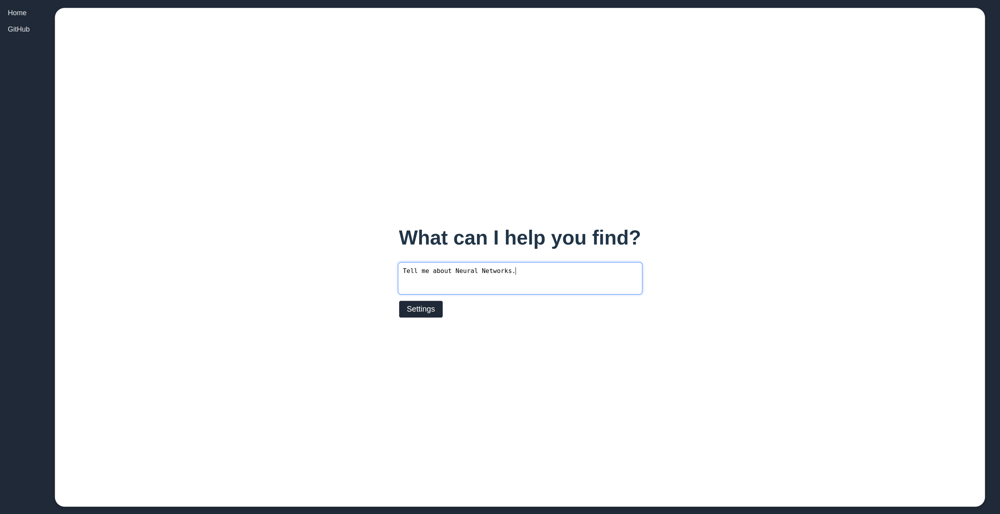
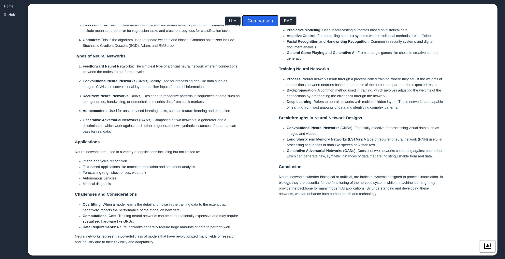
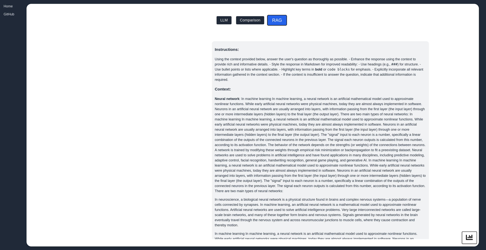

# LLMSearchEngine

## Overview

LLMSearchEngine is an experimental search engine designed to explore the differences between **Retrieval-Augmented Generation (RAG) and non-RAG** approaches when using Large Language Models (LLMs). This project provides a sandbox environment where users can **customize LLM behavior**, test search queries with and without RAG, and observe how retrieved context affects responses. The Large Language Models are inferenced locally using vLLM with the exception of GPT-3.5 and GPT-4 which are called from OpenAI's API.

## Features

- **Customizable LLM Parameters** – Modify model behavior to see how different settings affect output.
- **Retrieval-Augmented Generation (RAG) Pipeline** – Integrates a document retrieval system to enhance LLM responses.
- **Comparison Mode** – Directly compare responses from a standard LLM vs. an LLM using retrieved context.
- **Interactive Frontend** – User-friendly interface for testing and fine-tuning the search process.

## How the RAG Pipeline Works
- **User Query** - Keywords are extracted from the query using the KeyBERT model.
- **Document Retrieval** - Relevant documents are sourced from the internet (currently only Wikipedia) using keywords and then chunked.
- **Context Generation** - A cosine similarity is computed between each embedded chunk and the embedded query. If the computed cosine similarity is above a certain threshold, it is included in the context.
- **LLM Generation** - An augmented prompt is assembled with instructions and context, and then fed as input into the LLM.
- **Comparison Display** - Both responses are shown side-by-side

## Home Screen

## Settings Panel

## Demo Query Results:

## Comparison Page:

## LLM Panel:

## RAG Panel + Sources:

## Commentary
When prompted with a vague query like "Tell me about Neural Networks," a standard LLM provides a limited response focused only on machine learning, whereas the RAG model retrieves external knowledge, distinguishing between biological and artificial neural networks. This demonstrates how retrieval actively shapes generation, guiding the model toward a more comprehensive and context aware response. By supplying external context, RAG enables the model to handle ambiguity more effectively and produce richer, more informative answers. These results highlight the importance of retrieval in expanding the model’s understanding of user queries.
